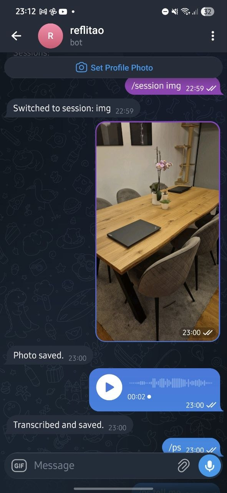
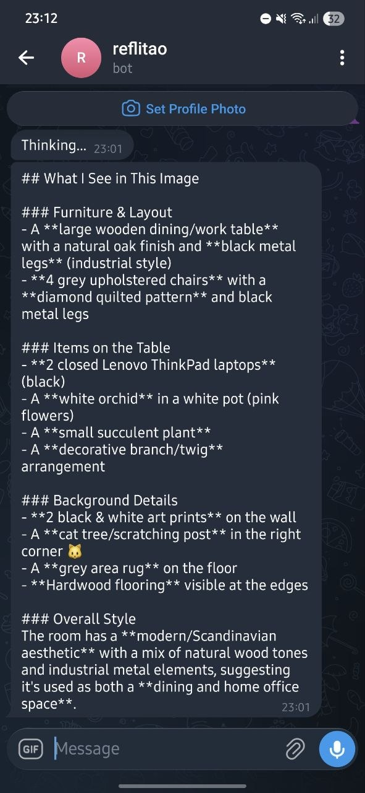

<p align="center">
  
</p>

<h1 align="center">reflitão</h1>

---

A Telegram bot for AI-assisted thinking. Collect mixed-media artifacts (text, audio, images) into named sessions, then query a multimodal LLM with all session content as context. Audio is auto-transcribed via Whisper.

## Features

- **Session management** — organize thoughts into named sessions
- **Text capture** — any message is saved as a timestamped artifact
- **Voice/audio transcription** — automatic Whisper transcription on upload
- **Photo collection** — images with optional captions stored in sessions
- **File uploads** — any document uploaded goes straight to the current session
- **LLM prompting with context** — query Claude Sonnet with your full session as context (`/ps`)
- **Raw LLM prompting** — quick questions without session context (`/p`)
- **Image generation** — generate images via OpenAI's gpt-image-1 (`/image`)
- **File retrieval** — download any session artifact via `/get`
- **Multi-user** — state is persisted per user, sessions are isolated
- **Flat-file storage** — no database, everything is inspectable on disk

## Requirements

- Python 3.11+
- [uv](https://docs.astral.sh/uv/getting-started/installation/)
- A Telegram bot token
- OpenAI API key (Whisper + image generation)
- Anthropic API key (Claude Sonnet)

## Installation

```bash
pip install reflitao
```

Or from source:

```bash
git clone https://github.com/luisarcher/reflitao-ai.git
cd reflitao-ai
uv sync
```

## Configuration

First-time setup (interactive):

```bash
reflitao init
```

This creates `~/.config/reflitao/config.toml`:

```toml
[keys]
telegram_token = "your-telegram-bot-token"
openai_api_key = "your-openai-api-key"
anthropic_api_key = "your-anthropic-api-key"
```

Alternatively, set environment variables (useful for Docker/CI):

```bash
export REFLITAO_TELEGRAM_TOKEN="..."
export REFLITAO_OPENAI_API_KEY="..."
export REFLITAO_ANTHROPIC_API_KEY="..."
```

Environment variables take priority over the config file.

## Usage

```bash
# Run the bot (sessions stored in current directory)
reflitao

# Or specify a workspace directory
reflitao ~/my-thinking-sessions

# Or via python -m
python -m reflitao [dir]
```

## Bot Commands

| Command | Alias | Description |
|---------|-------|-------------|
| `/session <name>` | `/s` | Create or switch to a named session |
| `/ls` | | List files in the current session |
| `/status` | | List all sessions with file-type counts |
| `/promptsession [prompt]` | `/ps` | Query LLM with session context (empty prompt allowed, only context is passed) |
| `/prompt <prompt>` | `/p` | Query LLM without session context |
| `/get <filename>` | | Download a file from the current session |
| `/image <description>` | | Generate an image from a text description |

All commands appear in the Telegram keyboard for quick access.

## How It Works

1. **Collect** — send text, voice, photos, or files to the bot. Everything is saved to your current session folder.
2. **Organize** — use `/s <name>` to create and switch between named sessions.
3. **Query** — use `/ps` to send a prompt to Claude Sonnet with all session artifacts as context. LLM responses are rendered in Markdown and persisted as `.md` files in the session.

## Screenshots

<p align="center">
  
  &nbsp;&nbsp;
  
</p>

## Use Cases

Most AI apps already support camera, audio, and text. How is this different?

With reflitao you **own** both input and output data as plain files on disk. Every session is a folder of timestamped `.md`, `.jpg`, and `.ogg` files you can inspect, version-control, or feed into other tools.

**Brainstorming with Obsidian** — run reflitao in your Obsidian vault directory. Thoughts captured via Telegram appear as `.md` files you can link to existing notes:

```
cd ~/obsidian-vault
reflitao
```

Send text, photos, or voice notes from your phone. Then:

```
/s brainstorm          # create a session
```

Send a photo, a voice memo, and some text messages. Then:

```
/ps summarize everything and suggest next steps
```

The LLM response is saved as a `_response.md` file right in your vault.

**Multi-topic sessions** — keep separate threads for different projects:

```
/s work-project
/s travel-plans
/status                # see all sessions with file counts
```

**Quick questions** — use `/p` for one-off prompts that don't need session context:

```
/p what's the capital of France?
```

**Review session contents** — check what's in the current session:

```
/ls                    # list files (like Linux ls)
/get 20260507120000.md # download a specific file
```

## Development

```bash
uv sync --group dev
uv run pytest
```

## License

[MIT](LICENSE)

## Linting & Formatting

```bash
uv run ruff check .
uv run ruff format .
```

## Type Checking

```bash
uv run ty check reflitao/
```

## Commit Convention

This project uses [Conventional Commits](https://www.conventionalcommits.org/) to drive automated versioning:

| Prefix | Effect |
|--------|--------|
| `fix:` | Patch release |
| `feat:` | Minor release |
| `feat!:` / `BREAKING CHANGE` | Major release |

## License

[MIT](LICENSE)
